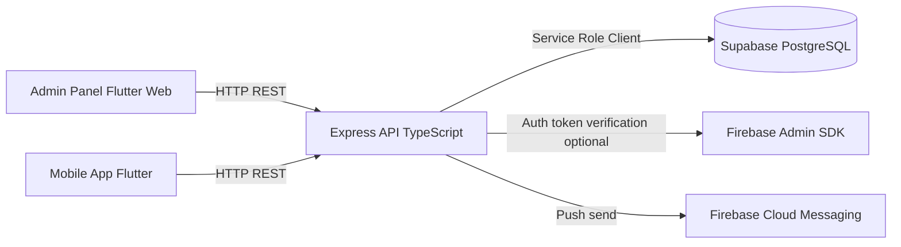
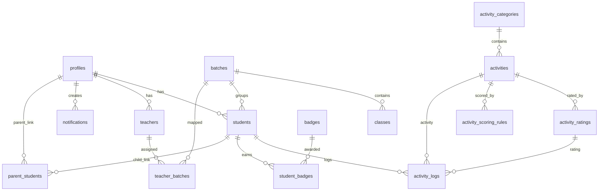

# Alif School Technical Architecture Presentation (Malayalam)

## 1. Project Introduction

Alif School ഒരു full-stack educational platform ആണ്. Traditional daily moral activity tracking (Ihthisab/Practical Record) ഡിജിറ്റൽ ആക്കി:

- Student activity logging
- Teacher and admin monitoring
- Parent visibility
- Score/rating based progress analytics
- Bilingual UX (English + Malayalam)

Current repository model: monorepo (backend + admin web + mobile + design system).

---

## 2. What Has Been Built So Far

### A. Frontend (Admin Web)

- Flutter Web app with modular admin screens:
  - Dashboard
  - Students
  - Teachers
  - Batches
  - Activities
  - Rating Rules
  - Notifications
  - Reports
- API integration layer present (`AdminApiClient` + `AdminRepository` pattern).
- Demo fallback state present when backend/API token config missing.
- Bypass login mode exists for development (`BYPASS_ADMIN_LOGIN`).

### B. Frontend (Mobile App)

- Flutter app with:
  - OTP login UI
  - Student selector
  - Daily marking screen
  - Progress view
  - Leaderboard screen
- HTTP API service layer created.
- Multiple screens still use mock data blocks (prototype stage).

### C. Backend

- Node.js + Express + TypeScript API server.
- Middleware: security headers, CORS, compression, logging, request context.
- Versioned route structure under `/api/*`.
- Service layer implemented for major domains (admin snapshot, teachers, activity logs, reports, notifications, achievements, auth).
- Supabase integration active for DB operations.

### D. Database

- Supabase PostgreSQL schema with core academic + activity tracking tables.
- RLS enabled on selected tables.
- Migration-driven schema management.
- Added quantity-based scoring rules + audit logs in latest migration.

---

## 3. High-Level Architecture

---

## 4. Exact Technology Stack Used

### Frontend

- Flutter (Dart)
- HTTP package for REST calls
- Google Fonts
- Custom theme and UI components

### Backend

- Node.js 18+
- Express.js
- TypeScript
- @supabase/supabase-js
- firebase-admin
- helmet, cors, compression, morgan
- Jest (tests), ESLint

### Data + Infra

- Supabase (PostgreSQL + Auth + Storage capability)
- Firebase Admin (partial integration)
- Supabase CLI scripts for migrations/local workflows

---

## 5. Supabase vs Firebase: Clear Positioning

## Why Supabase is the Primary Data Platform

1. Relational database need (students, batches, activities, ratings, logs, badges, parent relations).
2. SQL + migrations + constraints + joins required for reporting/analytics.
3. Row-Level Security policies for role-based data access.
4. Single platform can support DB + auth + storage integration.

## Firebase Status in Current Project

Firebase is configured as supplementary, not primary datastore.

- Present usage in backend:
  - Firebase Admin initialization
  - `/api/auth/firebase/verify` endpoint
  - FCM send path in notification service
- Not primary for CRUD data tables.

## Important Clarification for Presentation

"Project data persistence and domain operations are Supabase/PostgreSQL-centric. Firebase is currently optional/auxiliary, mainly intended for token verification and push delivery."

---

## 6. Database Architecture (Core Tables)

Notable recent DB enhancement:

- `activity_scoring_rules` table for quantity-based marking.
- `activity_logs.rating_id` nullable to support quantity-only entries.
- `audit_logs` for administrative action tracking.

---

## 7. Database Connection and Data Access Pattern

Backend uses centralized Supabase client configuration:

1. Environment variables:
   - `SUPABASE_URL`
   - `SUPABASE_ANON_KEY`
   - `SUPABASE_SERVICE_ROLE_KEY`
2. Server-side operations primarily use service-role Supabase client.
3. API route -> service layer -> Supabase table query/update.
4. Startup includes schema readiness check.

Security note:

- Service role key must stay backend-only.
- Frontend should never ship service-role key.

---

## 8. Authentication Architecture (Current)

Current codebase contains two auth tracks:

1. Newer auth service (`services/auth/auth-service.ts`) with:
   - Supabase `auth.getUser(accessToken)` verification attempt
   - fallback for JWT tokens issued by mock OTP flow
2. Legacy OTP service (`services/auth-service.ts`) still used by `/api/auth/request-otp` and `/api/auth/verify-otp`, currently mock-based OTP verification.

### Practical Impact

- OTP flow works for development/demo using mock conditions.
- Production-grade OTP should be switched to real Supabase OTP verification path end-to-end.

---

## 9. API Architecture (Active Route Groups)

Mounted in main server:

- `/api/auth`
- `/api/admin`
- `/api/students`
- `/api/teachers`
- `/api/academics`
- `/api/activities`
- `/api/activity-logs`
- `/api/achievements`
- `/api/reports`
- `/api/notifications`

Observation for guide presentation:

- Some legacy routes/files exist but are not mounted in main app.
- Mobile API client still references some legacy endpoint paths (integration gap to align).

---

## 10. Frontend Integration Status

## Admin Panel

- Can run as UI-driven operations dashboard.
- Uses env-based API base URL + optional token.
- If backend auth/API not configured, falls back to local demo state.

## Mobile App

- UI and flow mostly functional for demonstration.
- API service implemented, but several screens still mock-driven.
- Needs endpoint alignment with active backend route map.

---

## 11. Security and Governance Controls

- Helmet/CORS/compression enabled in backend.
- Role checks in middleware for admin/teacher/parent/student.
- Supabase RLS policies on key tables.
- Audit log table for admin actions.

Recommended hardening:

1. Remove real-looking keys from sample env files and rotate secrets.
2. Unify auth middleware stack to one implementation.
3. Ensure production OTP uses real provider calls.
4. Expand RLS to all sensitive tables consistently.

---

## 12. Development Workflow and Tooling

## Repository Workflow

- Monorepo with root scripts for backend lifecycle.
- Backend TypeScript build + Jest test + lint.
- Flutter analyze/test/build for admin and mobile apps.

## Operational Pattern

1. Update schema using Supabase migrations.
2. Implement/adjust backend services.
3. Connect admin/mobile API clients.
4. Run analyze/tests and fix regressions.

---

## 13. Current Strengths vs Gaps

## Strengths

- Strong base architecture across frontend, backend, and DB.
- Practical Supabase relational schema already in place.
- Admin domain model and aggregation service are usable.
- Bilingual UX and design-system direction established.

## Gaps

- Dual auth stacks increase complexity.
- OTP path still mock-heavy.
- Mobile endpoints partially misaligned with mounted backend routes.
- Mixed "prototype/demo" and "production" behaviors coexist.

---

## 14. Recommended Next Phase Plan

1. Auth consolidation
   - Keep one middleware + one auth service path.
   - Move OTP flow to real Supabase auth implementation.

2. API contract freeze
   - Publish definitive endpoint spec from mounted routes only.
   - Refactor mobile/admin API clients to match it.

3. Data + security hardening
   - Expand RLS and policy tests.
   - Secret rotation and env hygiene.

4. Production readiness
   - Add CI checks (lint, tests, analyze, build).
   - Add smoke tests for login + core CRUD + reports.

---

## 15. One-Line Guide Summary

"Alif School നിലവിൽ Supabase-centered full-stack architecture-ലേക്ക് solid foundation build ചെയ്തിട്ടുണ്ട്; admin side operationally structured ആണ്, mobile side prototype-to-integration transition stage-ലാണ്, Firebase primary database ആയി അല്ലാതെ auxiliary auth/push layer ആയി മാത്രം ഉപയോഗിക്കുന്നതാണ് current technical direction."
