# Architecture Diagrams

> Visual representations of project architecture

---

## 📊 Overall Architecture Flow

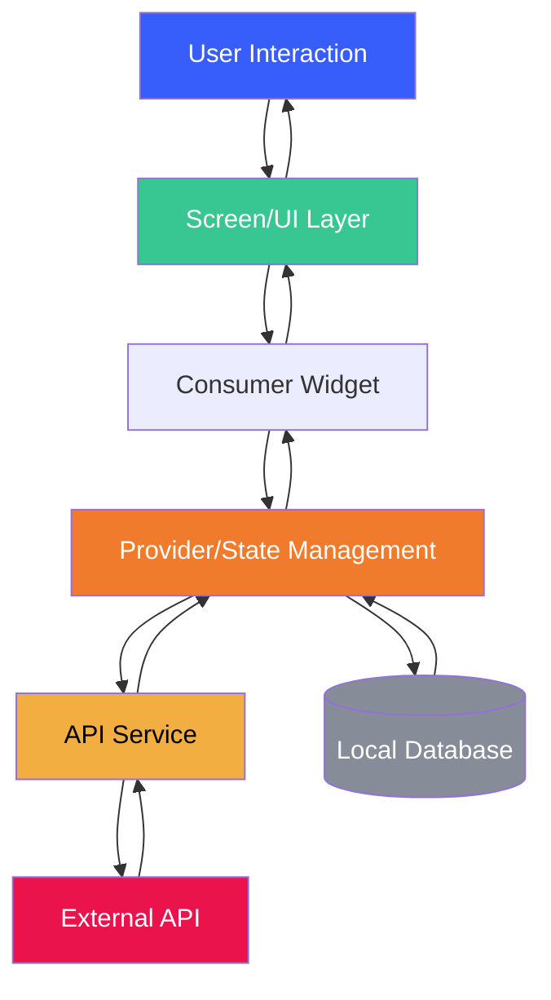

---

## 🏗️ Layer Architecture

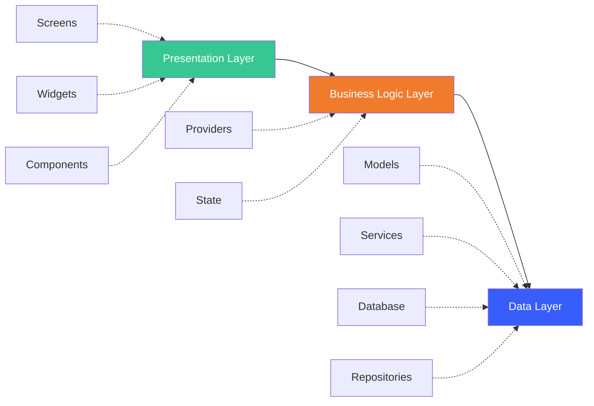

---

## 🔄 Provider State Flow

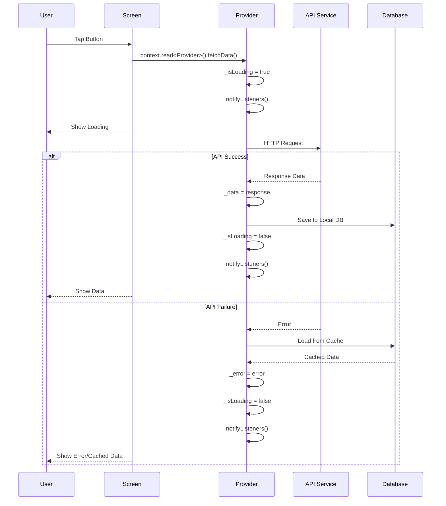

---

## 📁 Folder Structure Diagram

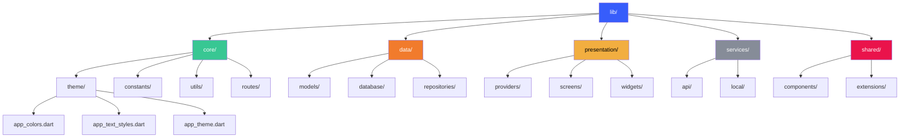

---

## 🔄 Data Flow - Collection Feature

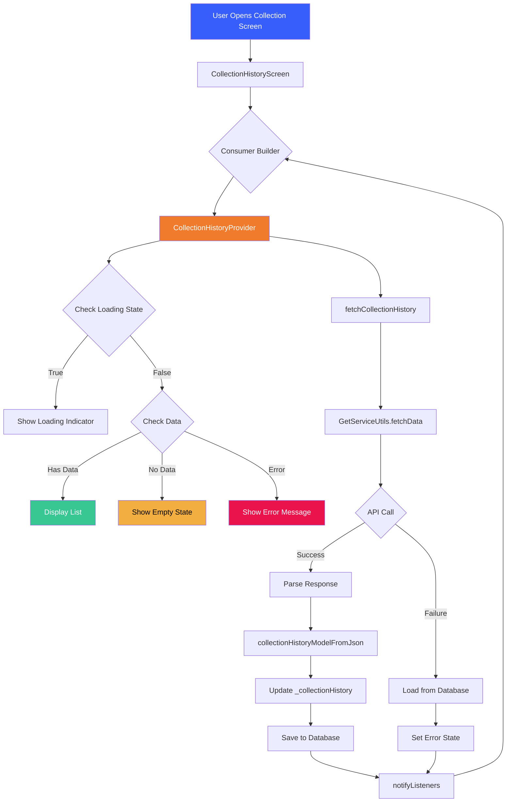

---

## 🎯 Screen Component Breakdown

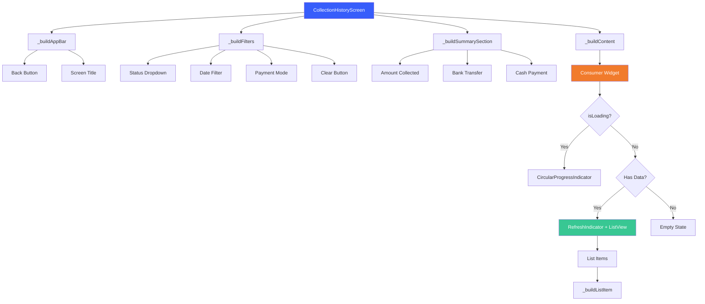

---

## 🌐 API Request Flow

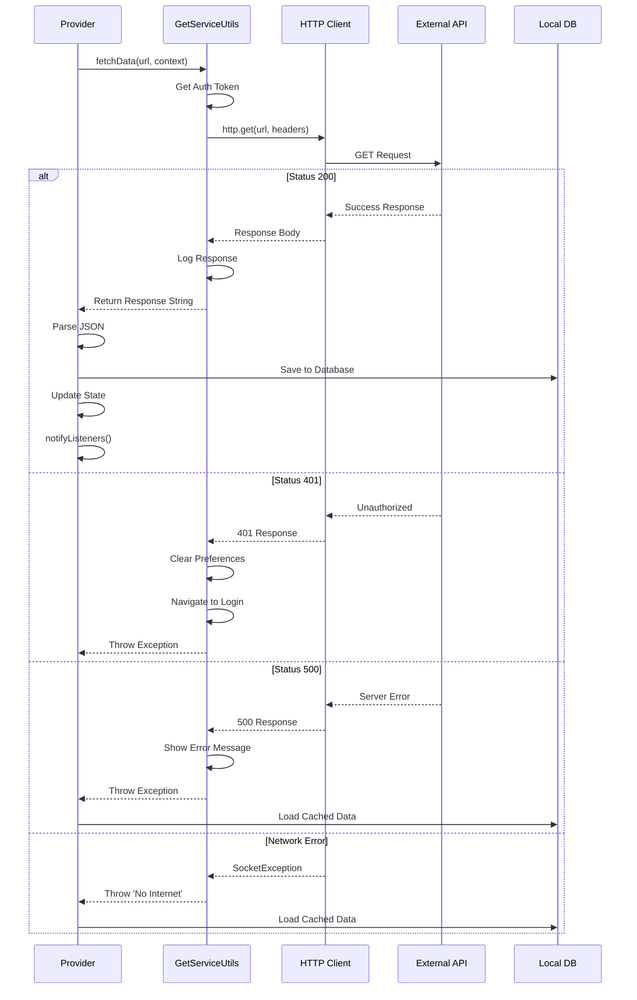

---

## 📦 Model Parsing Flow

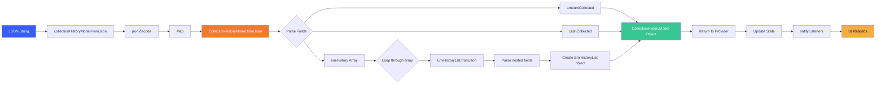

---

## 🔐 Authentication Flow

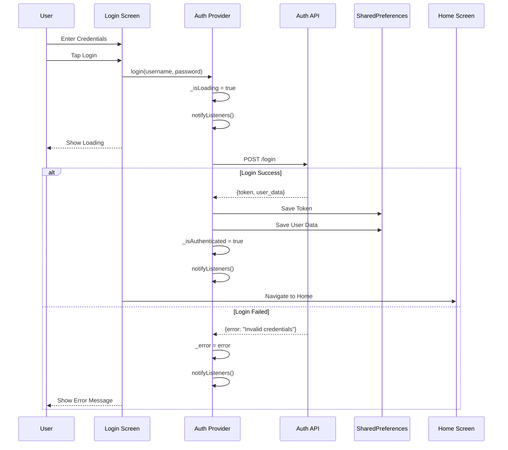

---

## 🗄️ Offline-First Strategy

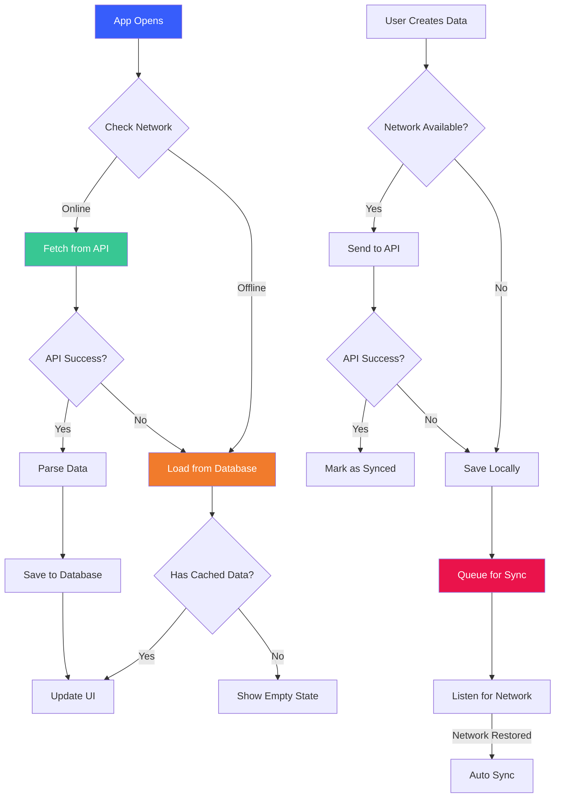

---

## 🎨 Theme System Structure

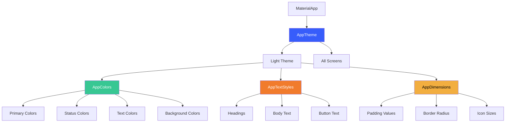

---

## 🧩 Component Hierarchy

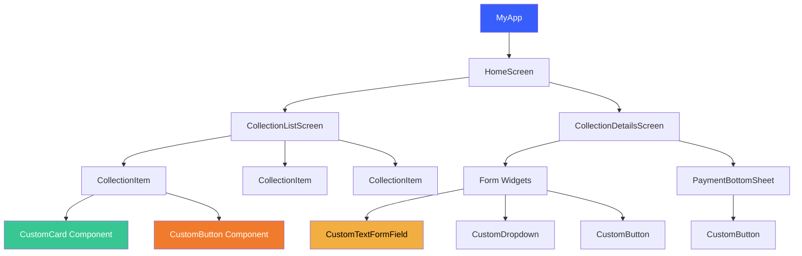

---

## 📱 Screen Lifecycle with Provider

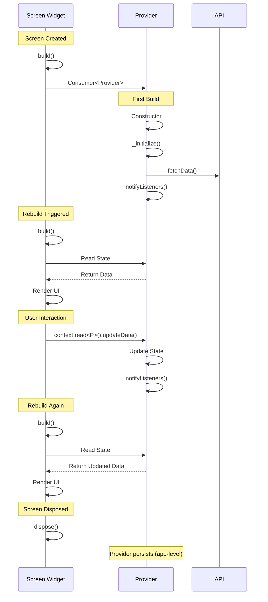

---

## 🚀 Feature Development Flow

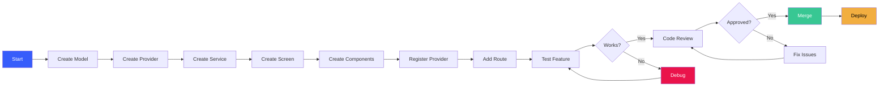

---

## 💾 Database Operations Flow

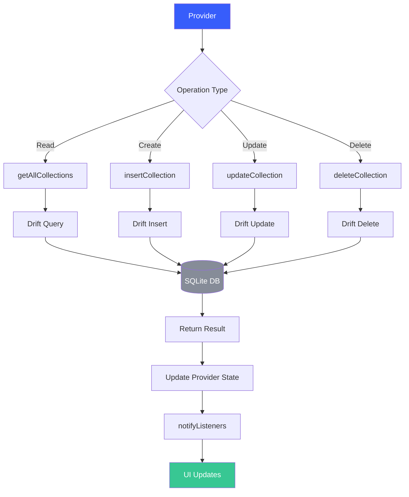

---

**ഈ diagrams VS Code-ലോ GitHub-ലോ open ചെയ്താൽ visual representation കാണാം!**

---

## 📖 References

- Mermaid Documentation: https://mermaid.js.org/
- Full Architecture: [FLUTTER_PROJECT_ARCHITECTURE.md](FLUTTER_PROJECT_ARCHITECTURE.md)
- Quick Reference: [ARCHITECTURE_QUICK_REFERENCE.md](ARCHITECTURE_QUICK_REFERENCE.md)

---

**Last Updated:** June 2026
